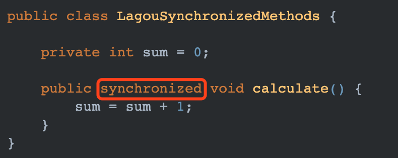
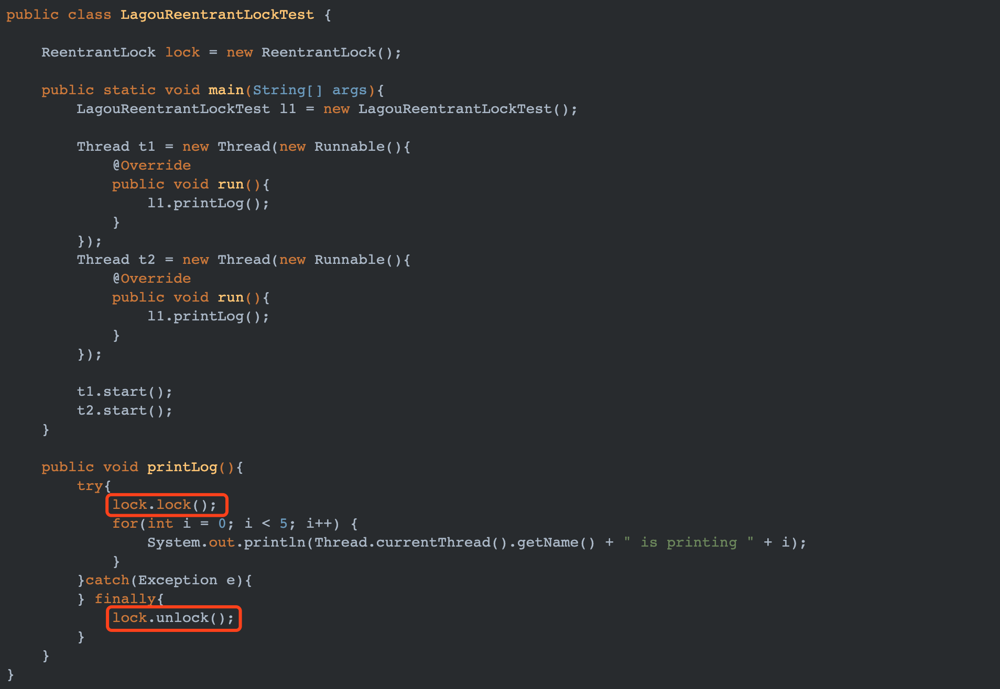

**synchronized**

synchronized 可以用来修饰以下 3 个层面：

修饰实例方法；

修饰静态类方法；

修饰代码块。

**synchronized 修饰实例方法**

这种情况下的锁对象是当前实例对象，因此只有同一个实例对象调用此方法才会产生互斥效果，不同实例对象之间不会有互斥效果。

**修饰静态类方法**

如果 synchronized 修饰的是静态方法，则锁对象是当前类的 Class 对象。因此即使在不同线程中调用不同实例对象，也会有互斥效果。

**synchronized 修饰代码块**

synchronized 作用于代码块时，锁对象就是跟在后面括号中的对象。上图中可以看出任何 Object 对象都可以当作锁对象。

**ReentrantLock**

**ReentrantLock 基本使用**

ReentrantLock 的使用同 synchronized 有点不同，它的加锁和解锁操作都需要手动完成。

使用 ReentrantLock 也能实现同 synchronized 相同的效果。

在上面 ReentrantLock 的使用中，我将 unlock 操作放在 finally 代码块中。这是因为 ReentrantLock 与 synchronized 不同，当异常发生时 synchronized 会自动释放锁，但是 ReentrantLock 并不会自动释放锁。因此好的方式是将 unlock 操作放在 finally 代码块中，保证任何时候锁都能够被正常释放掉。 

**公平锁实现**

